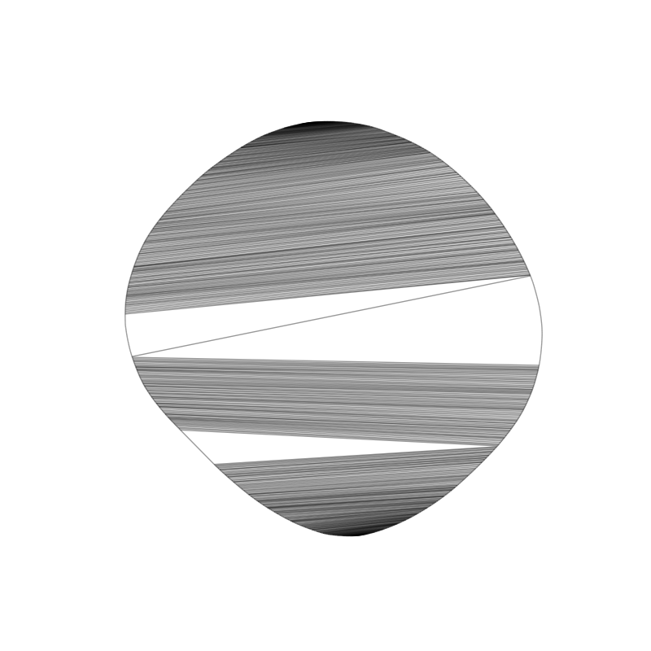

# Geometric Spanner Algorithms

## Degree 3 spanner



## How to use:

The way I use this is with Python3, Pip3, networkx and matplotlib.

```
pip3 install networkx matplotlib

python3 test_deg3_spanner.py
```

The degree 3 spanner algorithm from [here](papers/Deg-3-Spanner.pdf),
is implemented in algorithms.py, the function is called
deg3_plane_spanner.

#### Generating Lots of Graphs

```
python3 generate_graphs.py
python3 load_graph.py
```

Currently load_graph.py will plot the graph with the highest and
lowest stretch factors.

### Additional Info

Inside the folder testing/ are python3 scripts which served as
stepping stones for the implementation.

convex_hull_example.py draws the upper and lower chains of a convex
hull around a set of random points. It also obtains diametrical
points on the convex hull and draws a line between them.

networkx_example.py is the provided example of NetworkX library for
random geometric graphs.
([link](https://networkx.github.io/documentation/networkx-1.9/examples/drawing/random_geometric_graph.html))

randcon.py is an implementation of Valtr's algorithm for random
convex polygons. ([link](https://github.com/patmorin/randcon))

scipy_example.py uses the convex hull algorithm that comes with the
scipy library.

## Open Problems

What is the minimum t such that there is a t-spanner for any set of
points?

The plane 1.88-spanner paper has a PlaneSpanner algorithm for points
in convex position, can the algorithm be extended to general point
positions?

Is there an algorithm that makes plane spanners of maximum degree 3
for points in general position? what would its bounds be?

## Plan
1. Implement an algorithm that determines the stretch factor of any
given geometric graph.

2. Implement the algorithm that constructs the spanner mentioned
   above. plot the graph to see if it works

3. Run experiments on point sets in convex position to determine the
stretch factor ratio of the spanner mentioned above.

Keep track of the graphs.

4. Analyze the results of the experiments and make observations about
the pairs of points that attain the stretch factor.

5. Use the observations from 4. to improve the upper and lower bounds on
the stretch factor.

For LOWER BOUND try a big point set?

6. Use the knowledge obtained to design new algorithms for constructing
plane spanners for points that are not in convex position. 

## Definitions

geometric graph: G(S, E), where S is a non-empty finite set of points
in space, E is a set of edges that connect a pair of points, (p,q),
such that the weight of the edge is equal to the distance between the
points, |pq|

minimum path length: the minimum path length of two vertices, p,q is
denoted by |pq|_G, which is the shortest path from p to q

spanner: a graph in which all vertices are connected; there is a path
connecting any two vertices

t-spanner: a graph such that for any two points, p,q, |pq|_G <= t *
|pq|

stretch factor: the minimum value of t for a t-spanner of the graph

plane spanner: spanner whose edges do not cross when drawn on a plane

convex position: a set of points is in convex position if all the
points are on the convex hull formed from the points

chain: a path, sequence of consecutive points connected by edges

set E is a matching: no two edges of E are incident on the same vertex

diametrical pair: the largest distance between any pair of points in
a graph is the diameter. a diametrical pair is any pair with distance
equal to the diameter

Theorem: Let C be a fixed compact convex shape with k vertices in the
plane, let Xn be the random sample of n points chosen uniformly and
independently from inside C. let Zn denote the number of vertices of
the convex hull of Xn, then E[Zn] = O(k*logn). 
Reference: Har-Peled, On the Expected Complexity of Random Convex Hulls

## License

[MIT](LICENSE.txt)

[3rd party license](LICENSE_3RD_PARTY.txt)
